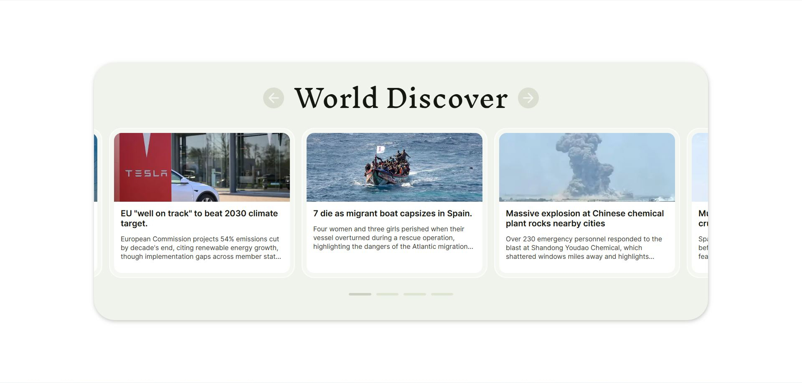

# Проект "Loop Slider" — Зацикленный слайдер с автопрокруткой и точками навигации

## О проекте

**Loop Slider** — это кастомный слайдер новостей с бесконечной прокруткой, точками навигации и автопрокруткой. Слайдер реализован на чистом JavaScript с применением принципов ООП и поддержкой плавной анимации переходов. При достижении края происходит зацикливание без рывков, что создаёт эффект непрерывного листания.

## Превью проекта

## Ссылка на демо

- [Посмотреть сайт](https://slider-project-rosy.vercel.app/)

## Статус проекта

Проект завершён.

## Функциональность

- **Автопрокрутка**: Слайды автоматически листаются с заданным интервалом.
- **Зацикливание слайдов**: При достижении края слайдер возвращается к началу или концу без рывков.
- **Навигация точками (dots)**: Активная точка подсвечивается при смене слайда.
- **Плавная анимация**: Анимация слайдов и точек через `transition`.
- **Блокировка кнопок на время анимации**: Исключает некорректное поведение при быстром взаимодействии.
- **Клонирование слайдов**: Создаёт иллюзию бесконечной ленты.
- **ООП-архитектура**: Вся логика инкапсулирована в классе `Slider`, разбитым на методы.

## Технологии и инструменты

- **HTML5** — Структура слайдера и точек.
- **CSS3** — Стилизация карточек, стрелок и dot-элементов.
- **JavaScript (ES6+)** — Логика, зацикливание, анимация, ООП.
